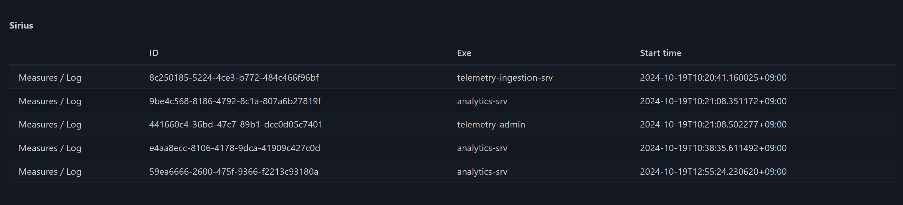
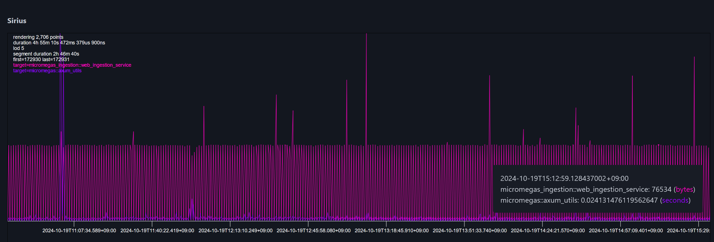
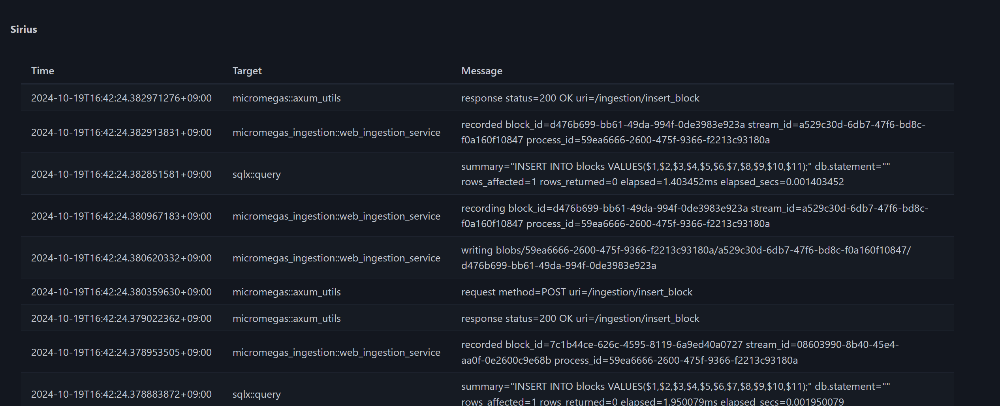

## Sirius, a Naive Graphical Client for [Micromegas](https://github.com/madesroches/micromegas)

Based on the [Micromegas](https://github.com/madesroches/micromegas) stack, Sirius offers a simple (and for the moment rather naive) graphical interface to view the logs, measures, and timelines for all your processes.

### What It (Currently) Looks Like

#### Processes page (~20% of Completion)



#### Metrics (~15% of Completion)



#### Log (~5% of Completion)



### Running the application

You need [Trunk](https://trunkrs.dev/) to be installed, then run:

```bash
trunk serve --release
```

Wait for compilation to complete and visit [http://localhost:8080](http://localhost:8080).

### What's Done

- [x] Process-oriented navigation
- [x] Basic log screen (limited to 5000 entries, PoC)
- [x] Basic measures screen
  - [x] All the measures displayed
  - [x] Pan/zoom/basic navigation
  - [x] Simple tooltip

### TODO

- [ ] Use Arrow on the frontend for the metrics
  - [ ] Store all the selected metrics in memory (capped)
  - [ ] Fetch the metrics by time range based on the viewport using DataFusion, local only for better transition
  - [ ] LoD client side
- [ ] Time-based pagination for the log screen
- [ ] Processes pagination
- [ ] Non-processes-based pagination and view, allow to see metrics and logs for more than one process at a time
- [ ] Timeline
- [ ] Improve performance and prevent too many allocations
- [ ] Remove the abusive `unwrap`s and `clone`s
- [ ] Cleanup components
